# YoctoBox
# Modules Yoctopuce pilotés par APP Blynk sur IOS au travers d'une gateway Raspberry Pi 4

Interface entre module Yoctopuce Wifi avec Display, carte 4 relais 240V et senseur de température, humidité et pression atmosphérique. Gateway au travers du Raspberry Pi 4 qui héberge le code python. Application Blynk sur SmartPhone IOS

# LES MODULES Yoctopuce
4 modules Yoctopuce sont nécessaires pour ce boitier YoctoBox: 

# Module Wifi Yoctopuce
Le YoctoHub-Wireless-n est un module doté d'une connexion réseau sans fil (au standard 802.11b/g/n) permettant d'héberger 3 modules Yoctopuce pour y accéder à distance. Il peut être alimenté à l'aide d'un câble USB Micro-B et d'un simple chargeur de téléphone portable, ou d'une batterie 5V. 

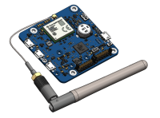

https://www.yoctopuce.com

# Module Display Yoctopuce
Le Yocto-Display est un écran OLED de 128x32 pixels pilotable directement par USB. Il est doté d'un processeur embarqué permettant d'effectuer de manière autonome des opérations graphiques simples, d'afficher du texte avec diverses polices de caractères et même de jouer des animations pré-enregistrées. Son utilisation par USB, sans driver, en fait une solution idéale comme petit écran de contrôle pour des applications embarquées pilotées par un mini-PC tel que le Raspberry Pi. 

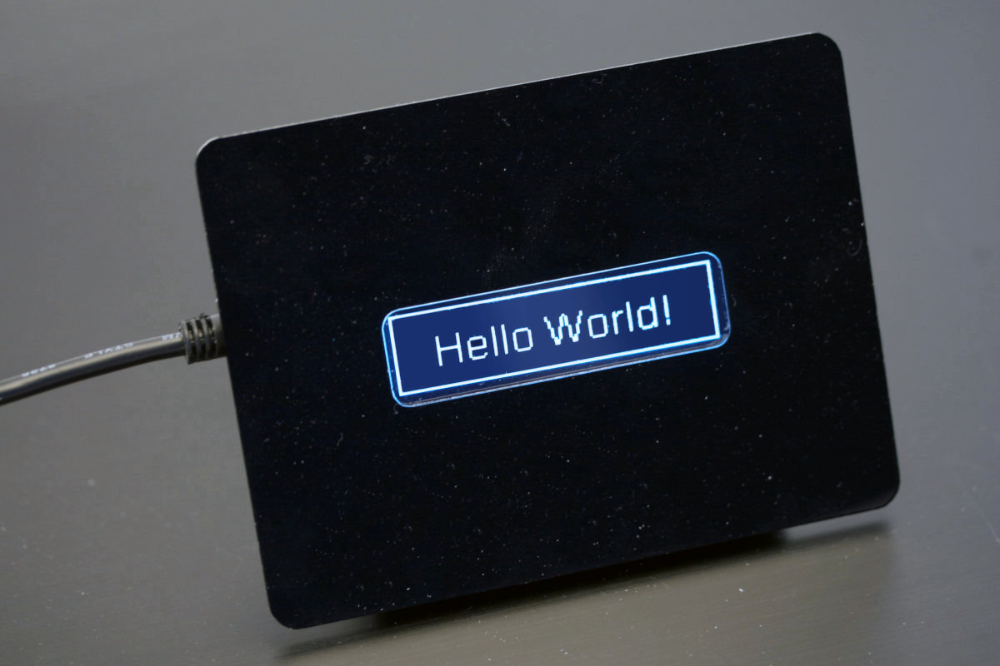

# Module Relais Yoctopuce
le Yocto-MaxiPowerRelay comprend 5 relais qui supportent jusqu'à 250V et et 5 ampères. L'état de chaque relais est indiqué par une LED indépendante. 

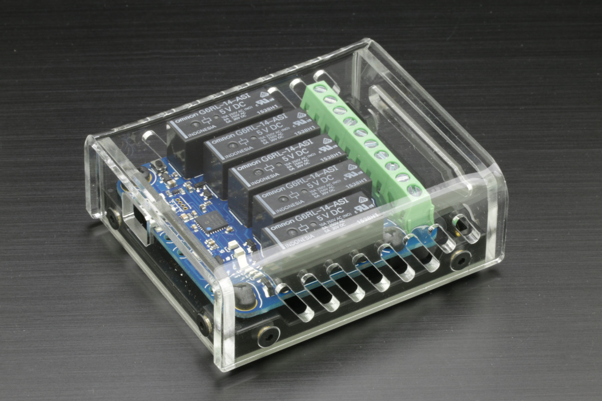

# Module Meteo Yoctopuce
Votre propre station météo USB: le module Yocto-Meteo permet d'effectuer des mesures instantanées de température, de pression et d'humidité via un port USB, ainsi que d'enregistrer des mesures en continu sur une mémoire flash intégrée et de les relire ultérieurement via USB. C'est le module idéal pour faire votre propre station météo et surveiller les conditions météorologiques dans votre jardin. 

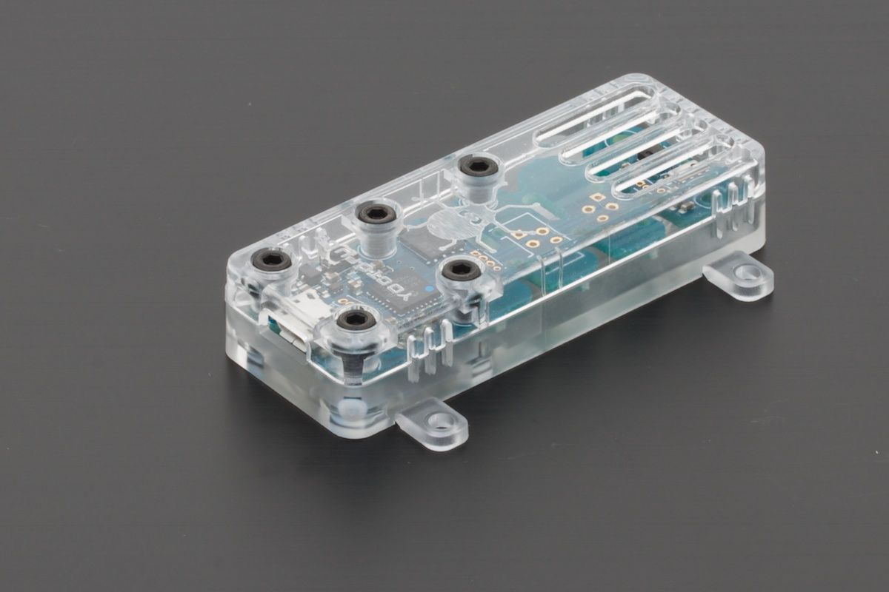

# Raspberry Pi 4
Le Raspberry Pi 4 n'a plus besoin d'être présenté...

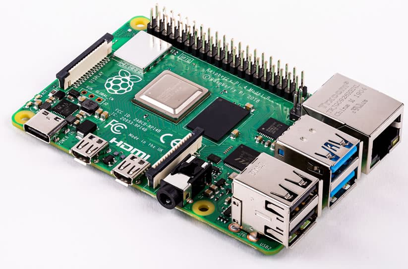

La station Terminal Raspberry PI 4 : 

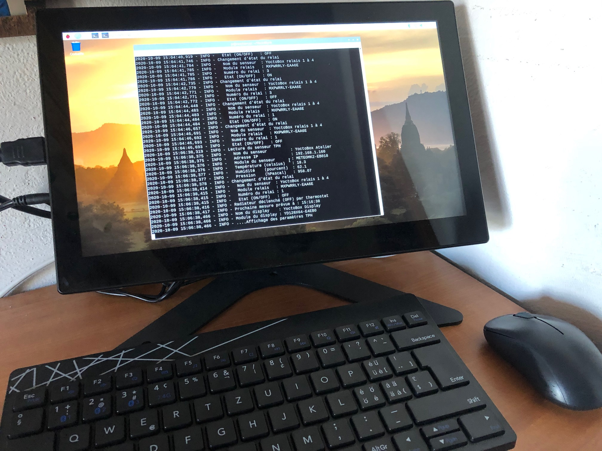

# Schéma de connectivité Yoctopuce
Les modules Yoctopuces sont connectés entre eux par des câbles USB. 
ATTENTION au câblage 240V sur les relais. Il doit être fait selon les règles de l'art et isolé du boitier pour assurer une sécurité maximale.

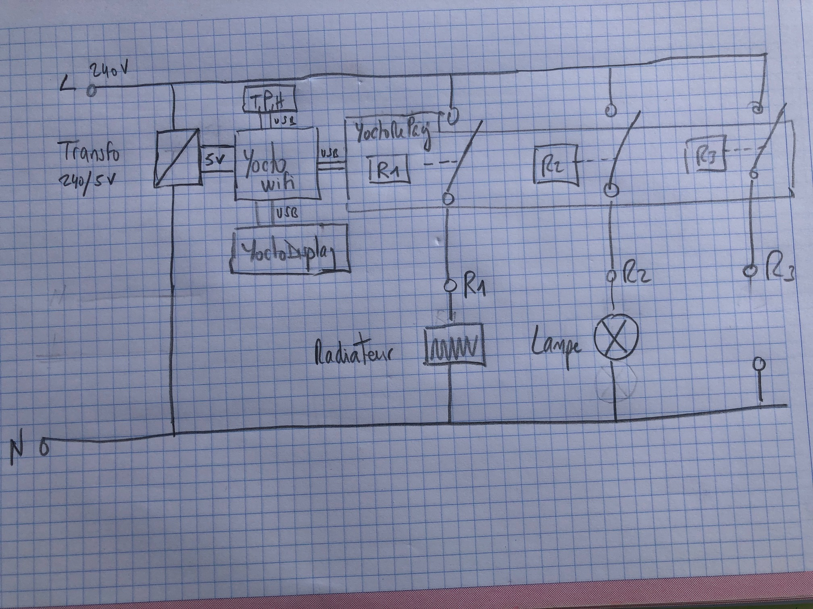

# Montage de la YoctoBox
La YoctoBox est montée dans un boitier étanche et résistant pouvant accueillir l'ensemble des modules.

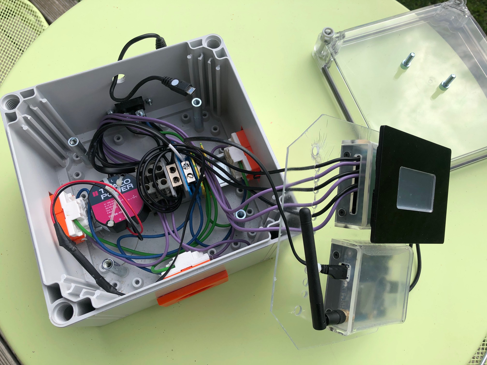

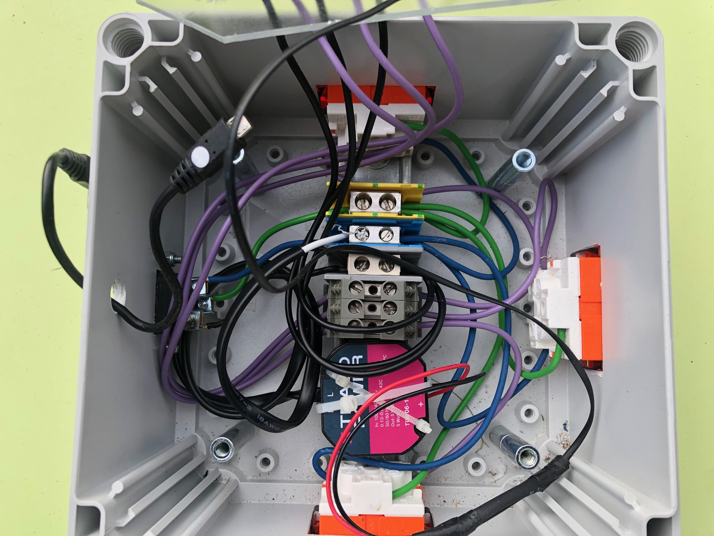

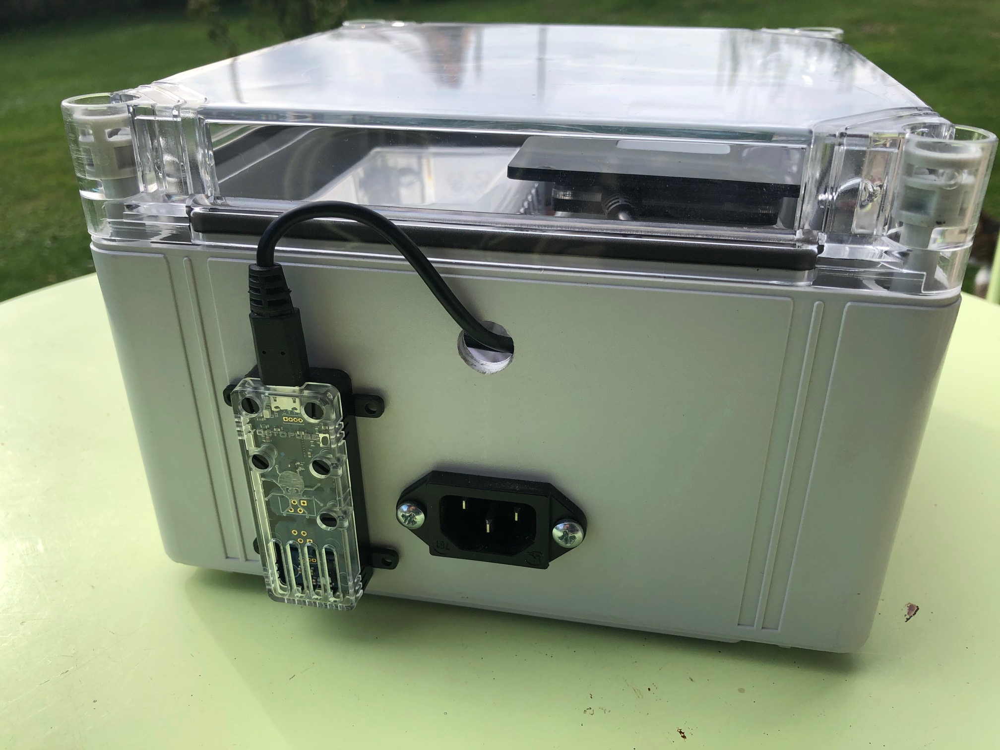

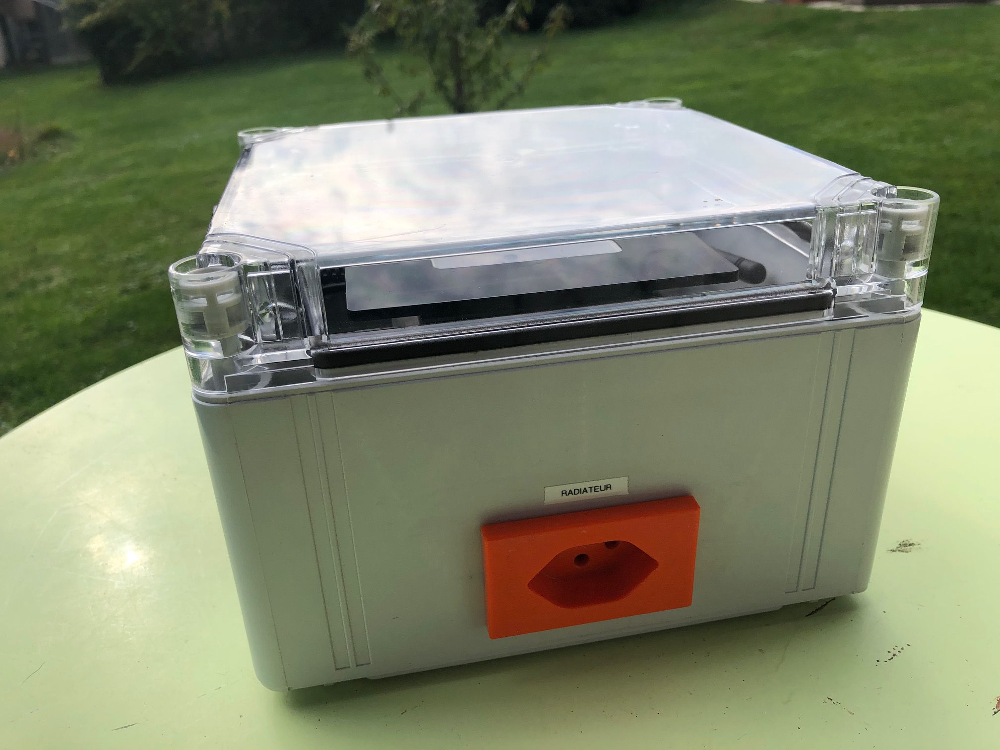
