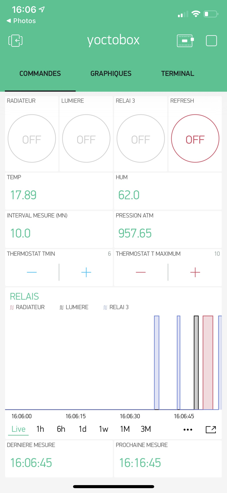
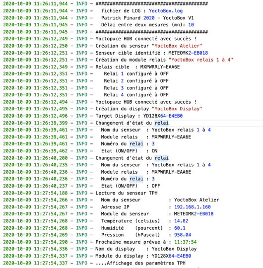

# YoctoBox
# Modules Yoctopuce pilotés par APP Blynk sur IOS au travers d'une gateway Raspberry Pi 4

Ce projet consiste à créer une APP avec Blynk permettant de piloter à distance un boitier (YoctoBox) comprenant des relais, un affichage et une sonde de température, pression et humidité.

Il est constitué de modules Yoctopuce insérés dans un boitier permettant d'assurer une isolation électrique entre la partie 240V et les modules Yoctopuce. 

Comme Yoctopuce n'offre pas de compatibilité avec Blynk pour un contrôle complet, une gateway est utilisée au travers d'un Raspberry Pi 4 qui héberge le code Python permettant d'assurer les commandes au module YoctoBox. 

La YoctoBox intègre un relai pour un radiateur qui peut être enclenché et déclenché par un thermostat sur l'APP Blynk (pin V8 et V9). 

Utilisation de Yoctopuce Wifi avec yocto-display (display OLED de 128x32 pixels), yocto-maxipowerrelay (carte 4 relais 240V) et yocto-meteo (senseur de température, humidité et pression atmosphérique). Gateway au travers du Raspberry Pi 4 qui héberge le code python. Application Blynk sur SmartPhone IOS

Blynk utilise des Virtual Pins qui sont pilotées par une gestion des événements @blynk.handle_event('write V1') en fonction des actions sur l'APP.
Par exemple, lorsque l'on presse sur le bouton lié à la virtual pin 1, le code ci-dessous s'execute : 

relai 1 (exemple simple)

    @blynk.handle_event('write V1')
    
    def write_virtual_pin_handler(pin, value): 
    
    if str(value[0]) == "1":
    
        Relay.setState(1,True)     
        
    else:
    
        Relay.setState(1,False)   
                
    return
    

une boucle dans le code principal comprenant blynk.run() est nécessaire pour gérer les événements : 

        .....
        
        while blynk.connect:
        
            blynk.run()
              
        .....

# librairie YoctoBox (YoctoBoxLib.py)
J'ai créé une librairie pour définir les objets Relay, Display et SensorTPH et pouvoir manipuler plus simplement ceux-ci dans le code principal.

    class YoctoSensorTPH(object):
    
    class YoctoRelay(object):
    
    class YoctoDisplay(object):
    

# BLYNK 
Blynk est un service web d'Internet des Objets (IoT) permettant de créer des Application sous Android/IOS rapidement et très simplement. Il exisite une multitude de libraiaire dans les languages C, Python disponibles sur GitHub. 

l'APP Blynk sous IOS est construite de la manière suivante : 

https://www.yoctopuce.com

La définition des Virtual Pin est représentée sur l'image suivante : 

# LES MODULES Yoctopuce
4 modules Yoctopuce sont nécessaires pour ce boitier YoctoBox: 

# Module Wifi Yoctopuce
Le YoctoHub-Wireless-n est un module doté d'une connexion réseau sans fil (au standard 802.11b/g/n) permettant d'héberger 3 modules Yoctopuce pour y accéder à distance. Il peut être alimenté à l'aide d'un câble USB Micro-B et d'un simple chargeur de téléphone portable, ou d'une batterie 5V. 

https://www.yoctopuce.com

# Module Display Yoctopuce
Le Yocto-Display est un écran OLED de 128x32 pixels pilotable directement par USB. Il est doté d'un processeur embarqué permettant d'effectuer de manière autonome des opérations graphiques simples, d'afficher du texte avec diverses polices de caractères et même de jouer des animations pré-enregistrées. Son utilisation par USB, sans driver, en fait une solution idéale comme petit écran de contrôle pour des applications embarquées pilotées par un mini-PC tel que le Raspberry Pi. 

# Module Relais Yoctopuce
le Yocto-MaxiPowerRelay comprend 5 relais qui supportent jusqu'à 250V et et 5 ampères. L'état de chaque relais est indiqué par une LED indépendante. 

# Module Meteo Yoctopuce
Votre propre station météo USB: le module Yocto-Meteo permet d'effectuer des mesures instantanées de température, de pression et d'humidité via un port USB, ainsi que d'enregistrer des mesures en continu sur une mémoire flash intégrée et de les relire ultérieurement via USB. C'est le module idéal pour faire votre propre station météo et surveiller les conditions météorologiques dans votre jardin. 

# Raspberry Pi 4
Le Raspberry Pi 4 n'a plus besoin d'être présenté...

La station Terminal Raspberry PI 4 : 

# Schéma de connectivité Yoctopuce
Les modules Yoctopuces sont connectés entre eux par des câbles USB. 
ATTENTION au câblage 240V sur les relais. Il doit être fait selon les règles de l'art et isolé du boitier pour assurer une sécurité maximale.

# Montage de la YoctoBox
La YoctoBox est montée dans un boitier étanche et résistant pouvant accueillir l'ensemble des modules.

# Fichier de LOG
Un fichier de LOG permet de contrôler l'ensemble des actions et mesures faites sur le YoctoBox. Le LOG est disponible sur le Raspberry Pi sous le fichier YocotBox.log.

Exemple du LOG file : 

# Code principal

    # Auteur    : Patrick Pinard
    # Date      : 4.10.2020
    # Objet     : interface Yoctopuce et Blynk avec APP IOS 
    # Version   : 1.0
    # -*- coding: utf-8 -*-

    import logging
    import blynklib
    import time
    from datetime import datetime, timedelta
    import os
    from YoctoBoxLib import YoctoSensorTPH, YoctoRelay,YoctoDisplay

    global delay
    delay = 600  # temps en sec entre deux lectures des senseurs
    global Tmin
    global Tmax
    path = "/home/pi/YoctoBlynßk"

    BLYNK_AUTH = 'clé blynk'
    blynk = blynklib.Blynk(BLYNK_AUTH)

    logging.basicConfig(filename='YoctoBox.log', filemode='w', level=logging.INFO, format='%(asctime)s - %(levelname)s - %(message)s')
    logging.info('########################################')
    logging.info('  fichier de LOG : YoctoBox.log')
    logging.info('  Patrick Pinard 2020 - YoctoBox V1')
    logging.info('  Délai entre deux mesures (mn): %s', int(delay/60))
    logging.info('########################################')

    # relai 1
    @blynk.handle_event('write V1')
    def write_virtual_pin_handler(pin, value):
        if str(value[0]) == "1":
            Relay.setState(1,True)     
        else:
            Relay.setState(1,False)   
        return

    # relai 2
    @blynk.handle_event('write V2')
    def write_virtual_pin_handler(pin, value):
        if str(value[0]) == "1":
            Relay.setState(2,True)
        else:
            Relay.setState(2,False)
        return

    # relai 3
    @blynk.handle_event('write V3')
    def write_virtual_pin_handler(pin, value):
        if str(value[0]) == "1":
            Relay.setState(3,True)
        else:
            Relay.setState(3,False)
        return

    def next_time():
        departure_time = time.strftime("%H:%M:%S")
        delaystr = "00:10:00"
        departure_time_obj = datetime.strptime(departure_time, '%H:%M:%S')
        delay_obj = datetime.strptime(delaystr, '%H:%M:%S') 
        next_time = departure_time_obj + timedelta(hours=delay_obj.hour, minutes=delay_obj.minute, seconds=delay_obj.second)
        next_time = next_time.strftime("%H:%M:%S")
        logging.info('Prochaine mesure prévue à : %s', next_time)
        return next_time

    # refresh
    @blynk.handle_event('write V4')
    def write_virtual_pin_handler(pin, value):
        if str(value[0]) == "1":
            send_TPH()   
            logging.info('Demande manuelle de lecture des données du senseur TPH !')       
        return

    # TPH V5, V6, V7
    def send_TPH():
        global Meteo, Display
        Meteo.read()
        blynk.virtual_write(5,Meteo.temperature) 
        blynk.virtual_write(6,Meteo.humidity) 
        blynk.virtual_write(7,Meteo.pressure) 
        now = time.strftime("%H:%M:%S")
        blynk.virtual_write(10,now)
        if int(Meteo.temperature) < Tmin:
            Relay.setState(1,True)
            blynk.virtual_write(1,1)
            logging.info('Radiateur enclenché (ON) par thermostat')
        if int(Meteo.temperature) > Tmax:
            Relay.setState(1,False)
            blynk.virtual_write(1,0)
            logging.info('Radiateur déclenché (OFF) par thermostat')
        if Meteo.temperature <= Tmin:
            logging.info('Température basse : <= %s °C !', Tmin)
        blynk.virtual_write(12,next_time())
        Display.display(Meteo.temperature,Meteo.pressure,Meteo.humidity,now)
        return

    # Tmin
    @blynk.handle_event('write V9')
    def write_virtual_pin_handler(pin, value):
        global Tmin, Tmax  
        Tmin = int(value[0])
        logging.info('Changement de Tmin : %s ', Tmin)
        return

    # Tmax
    @blynk.handle_event('write V8')
    def write_virtual_pin_handler(pin, value):
        global Tmin, Tmax  
        Tmax = int(value[0])
        logging.info('Changement de Tmax : %s ', Tmax)
        return    

    if __name__ == '__main__':
        Meteo = YoctoSensorTPH('YoctoBox Atelier')
        Relay = YoctoRelay('YoctoBox relais 1 à 4')
        Display = YoctoDisplay('YoctoBox Display')
        start_time = time.time()  
        Tmin = 5
        Tmax = 15
    try:
        while blynk.connect:
            blynk.run()
            interval = int(time.time() - start_time ) 
            blynk.virtual_write(11,delay/60) 
            if (interval > delay):
                send_TPH()   
                start_time = time.time() 

    except KeyboardInterrupt:
        blynk.disconnect()
        logging.info('Programme YoctoBox terminé')

# Librairie YoctoBoxLib.py

    # Auteur    : Patrick Pinard
    # Date      : 14.08.2020
    # Objet     : gestion de senseur Yoctopuce pour température humidité et pression ainsi que relais et affichage
    # Version   : 1
    # -*- coding: utf-8 -*-

    from yoctopuce.yocto_api import *
    from yoctopuce.yocto_humidity import *
    from yoctopuce.yocto_temperature import *
    from yoctopuce.yocto_pressure import *
    from yoctopuce.yocto_relay import *
    from yoctopuce.yocto_lightsensor import *
    from yoctopuce.yocto_display import *
    import logging

    target_sensor = ''
    target_relay = ''
    target_display = ''

    YOCTO_IP_ADDRESS        = "192.168.1.160"

    #logging.basicConfig(filename='YoctoBox.log', filemode='w', level=logging.INFO, format='%(asctime)s - %(levelname)s - %(message)s')
    #logging.info('------- {  fichier log du YoctoBox } ----------')
    #logging.info('Yoctopuce IP address : %s', YOCTO_IP_ADDRESS)
    logging = logging.getLogger()

    class YoctoSensorTPH(object):

    """
    Classe definissant un senseur de température, pression et humidité caracterisé par :
        - name : nom du senseur
        - module : référence du module Yoctopuce
        - temp : température en degré celsius
        - pressure : pression atmosphérique en hectoPascal
        - humidity: humidité en pourcentage
    """

    def __init__(self, name):
        """
        Constructeur de la classe Sensor.
        valeurs t, p, h  à zéro par défaut
        """
        global target_sensor

        errmsg = YRefParam()
        # Setup the API to use local Yoctopuce Wireless Hub
        if YAPI.RegisterHub(YOCTO_IP_ADDRESS, errmsg) != YAPI.SUCCESS:
            sys.exit("... Yoctopuce HUB init error....")
        else:
            logging.info('Yoctopuce HUB connecté avec succès !')

        logging.info('Création du senseur "%s"', name)  
        # setup Yoctopuce meteo sensor module
        sensor = YHumidity.FirstHumidity()
        if sensor is None:
            msg = 'Pas de module METEO (T,H,P) connecté au Yoctopuce HUB'
            sys.exit(msg)
        m = sensor.get_module()
        target_sensor = m.get_serialNumber()
        logging.info('Senseur cible identifié : %s', target_sensor)
        
        self.name = name     
        self.module = target_sensor                                        
        self.temperature = 0                                                             
        self.pressure = 0                                                
        self.humidity = 0
        self.ip = YOCTO_IP_ADDRESS 

        return

    def __repr__(self):
        """
        Méthode permettant d'afficher les paramètres d'un senseur
        """
        return "\n  Senseur     : {}\n  IP address  : {}\n  Température : {}\n  Pression    : {}\n  Humidité    : {}\n".format(self.name,self.ip, self.temperature,self.pressure,self.humidity)

    
    def read(self):
        """
        Méthode permettant de lire les valeurs du senseur t, p, h et enregistrement dans fichier log.
        """
        global target_sensor
        logging.info("Lecture du senseur TPH")
        humSensor = YHumidity.FindHumidity(target_sensor + '.humidity')
        pressSensor = YPressure.FindPressure(target_sensor + '.pressure')
        tempSensor = YTemperature.FindTemperature(target_sensor + '.temperature')
        self.temperature = tempSensor.get_currentValue()
        self.humidity = humSensor.get_currentValue()
        self.pressure = pressSensor.get_currentValue()
        logging.info('  Nom du senseur          : %s', self.name)
        logging.info('  Adresse IP              : %s', self.ip)
        logging.info('  Module du senseur       : %s', self.module)
        logging.info('  Température (celsius)   : %s', self.temperature)
        logging.info('  Humidité    (pourcent)  : %s', self.humidity)
        logging.info('  Pression    (hPascal)   : %s', self.pressure)
        
        return

    class YoctoRelay:

    """
    Classe definissant un Module Relais caracterisé par :
        - name : nom du module Relai
        - module : référence du module Yoctopuce
        - num : numéro du relai (1,2,3,4)
        - state : état du relai (ON : True; OFF : False)
    """

    def __init__(self, name):
        """
        Constructeur de la classe YoctoRelay pour module 4 relais Yoctoupce.
        Etat de tous les relais forcés à OFF
        """
        global target_relay

        logging.info('Création du module relais "%s"', name)  
        errmsg = YRefParam()
        # Setup the API to use local Yoctopuce Wireless Hub
        if YAPI.RegisterHub(YOCTO_IP_ADDRESS, errmsg) != YAPI.SUCCESS:
            sys.exit("... Yoctopuce HUB initialisation ERROR....")
        relay_module = YRelay.FirstRelay()
        if relay_module is None:
            msg = 'Pas de module RELAY connecté au YoctoBox'
            sys.exit(msg)
        n = relay_module.get_module()
        target_relay = n.get_serialNumber()
        logging.info('Relais cible  : %s', target_relay)
       
        self.relay1 = YRelay.FindRelay(target_relay + '.relay' + '1')
        self.relay2 = YRelay.FindRelay(target_relay + '.relay' + '2')
        self.relay3 = YRelay.FindRelay(target_relay + '.relay' + '3')
        self.relay4 = YRelay.FindRelay(target_relay + '.relay' + '4')
        
        self.relay1.set_output(YRelay.OUTPUT_OFF)
        self.relay2.set_output(YRelay.OUTPUT_OFF)
        self.relay3.set_output(YRelay.OUTPUT_OFF)
        self.relay4.set_output(YRelay.OUTPUT_OFF)

        self.name = name     
        self.module = target_relay                                        
                
        logging.info('   Relai 1 configuré à OFF')
        logging.info('   Relai 2 configuré à OFF')
        logging.info('   Relai 3 configuré à OFF')
        logging.info('   Relai 4 configuré à OFF') 

        return

    def __repr__(self):
        """
        Méthode permettant d'afficher les paramètres d'un senseur
        """
        return "\n  Relais : {}\n  1 : {}\n  2    : {}\n  3    : {}\n 4    : {}\n".format(self.name,self.relay1,self.relay2,self.relay3, self.relay4)

    
    def readState(self, number):
        """
        Méthode permettant de lire les états du relai -number et enregistrement dans fichier log.
        Retourne l'état du relai ON = True; OFF = False
        """
        global target_relay
        logging.info("Lecture du relai")
        relay = YRelay.FindRelay(target_relay + '.relay' + str(number))
        relaystate = relay.get_state
        logging.info('  Nom du senseur  : %s', self.name)
        logging.info('  Module relais   : %s', self.module)
        logging.info('  Numéro du relai : %s', number)
        if relaystate == YRelay.STATE_A:
            logging.info(' Etat (ON/OFF)    : ON')
            return True
        else:
            logging.info(' Etat (ON/OFF)    : OFF')
            return False
        

    def setState(self, number, state):
        """
        Méthode permettant de changer l'état du relai -number et enregistrement dans fichier log.
        Paramètre state : True = ON; False = OFF
        """
        global target_relay
        logging.info("Changement d'état du relai")
        relay = YRelay.FindRelay(target_relay + '.relay' + str(number))
        if not (relay.isOnline()):
            logging.info('Relai non connecté') 
        if relay.isOnline():
            if state :
                relay.set_output(YRelay.OUTPUT_ON)
                relaystate = 'ON'
            else:
                relay.set_output(YRelay.OUTPUT_OFF)
                relaystate = 'OFF'
        else:
            logging.info('Relai non connecté') 

        logging.info('  Nom du senseur  : %s', self.name)
        logging.info('  Module relais   : %s', self.module)
        logging.info('  Numéro du relai : %s', number)
        logging.info('  Etat (ON/OFF)   : %s', relaystate)
        

        return

    class YoctoDisplay:

    """
    Classe definissant un display module Yoctopuce caracterisé par :
        - name : nom du display
        - text : affichage du texte sur display
    """

    def __init__(self, name):
        """
        Constructeur de la classe Display.
        """
        global target_display

        errmsg = YRefParam()
        # Setup the API to use local Yoctopuce Wireless Hub
        if YAPI.RegisterHub(YOCTO_IP_ADDRESS, errmsg) != YAPI.SUCCESS:
            sys.exit("... Yoctopuce HUB init error....")
        else:
            logging.info('Yoctopuce HUB connecté avec succès !')

        logging.info('Création du display "%s"', name)  
        # setup Yoctopuce display module
        disp = YDisplay.FirstDisplay()
        if disp is None:
            die('No module DISPLAY connected')
        self.d = disp.get_module()
        target_display = self.d.get_serialNumber()
        logging.info('Target Display : %s', target_display)

        # display clean up
        disp.resetAll()

        # retreive the display size
        w = disp.get_displayWidth()
        h = disp.get_displayHeight()

        # retreive the first layer
        l0 = disp.get_displayLayer(0)
        l0.clear()

        # display a text in the middle of the screen 
        l0.drawText(10, 10, YDisplayLayer.ALIGN.CENTER_LEFT, "Température__(  °C ) = " )
        l0.drawText(10, 20, YDisplayLayer.ALIGN.CENTER_LEFT, "Humidité______(  %  ) = " )
        l0.drawText(10, 30, YDisplayLayer.ALIGN.CENTER_LEFT, "Pression_____( hPa ) = ")
        l0.drawText(60, 50, YDisplayLayer.ALIGN.CENTER, "Dernière mesure : ")

        self.l1 = disp.get_displayLayer(1)
        self.name = name     
        self.module = target_display                                        
        
        return

    def __repr__(self):
        """
        Méthode permettant d'afficher les paramètres d'un senseur
        """
        return "\n  Display     : {}\n  Texte 1 : {}\n".format(self.name,self.text)

    
    def display(self, t,p,h,curr_time):
        """
        Méthode permettant d'afficher un texte et enregistrement dans fichier log.
        """
        global target_display
        
        if self.d.isOnline(): 
            logging.info('Nom du display    : %s', self.name)
            logging.info('Module du display : %s', self.module)
            logging.info('....Affichage des paramètres TPH')
            self.l1.clear()
            self.l1.drawText(110, 10, self.l1.ALIGN.CENTER_RIGHT, str(t))
            self.l1.drawText(110, 20, self.l1.ALIGN.CENTER_RIGHT, str(h))
            self.l1.drawText(110, 30, self.l1.ALIGN.CENTER_RIGHT, str(p))
            self.l1.drawText(60, 60, self.l1.ALIGN.CENTER, str(curr_time))
        else:
            logging.info("!!!!! Module Display pas atteignable !!!!! ")
        return
